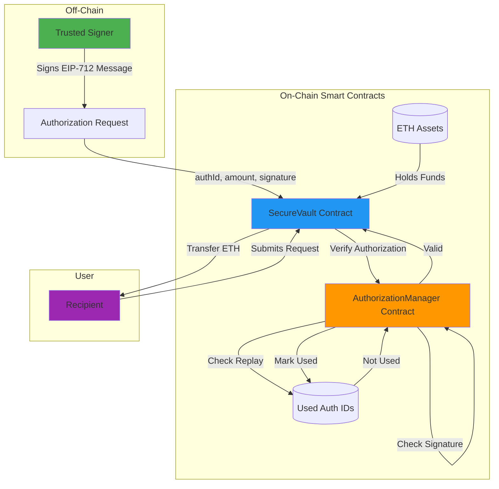
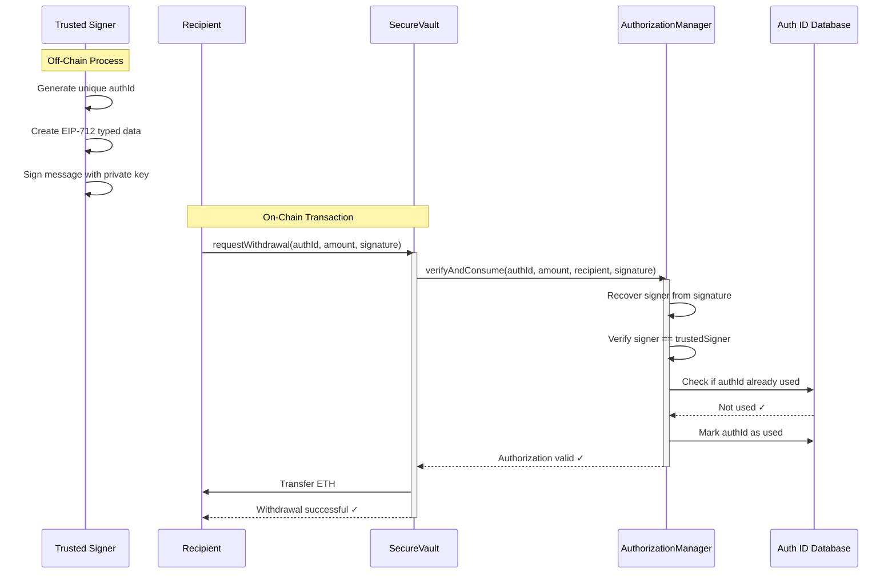
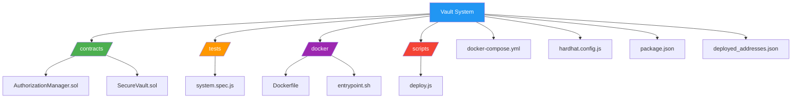

# Secure Vault System

A blockchain-based secure vault that utilizes **EIP-712 Typed Data Signatures** to authorize withdrawals. This system ensures that funds are only released when a trusted off-chain signer provides a valid, unique cryptographic permission.

## 🚀 System Architecture

The project consists of two primary smart contracts:
1.  **AuthorizationManager**: Handles the cryptographic verification of signatures and prevents "replay attacks" by tracking unique `authId`s.
2.  **SecureVault**: Holds the ETH assets and interacts with the Manager to validate requests before releasing funds.



---

## 🛠 Features

* **Cryptographic Security**: Uses EIP-712 standard for human-readable, secure signing.
* **Reentrancy Protection**: Uses OpenZeppelin’s `ReentrancyGuard` to prevent exploit attempts during withdrawals.
* **Replay Protection**: Each authorization is unique and can only be consumed once.
* **Dockerized Environment**: Fully containerized Hardhat environment for consistent deployment.

### Withdrawal Flow



---

## 📋 Prerequisites

* **Docker** and **Docker Compose**
* **Node.js** (Optional, for local development)

---

## ⚙️ Setup and Deployment

### 1. Start the Environment
Run the following command to start the local blockchain and deploy the contracts automatically:
```powershell
docker-compose up -d
2. Verify Deployment
To see the deployed contract addresses:

PowerShell

cat deployed_addresses.json
🧪 Local Validation (System Integration)
We use automated tests to verify the security of the vault. The tests cover:

Unauthorized Access: Ensuring that requests with invalid signatures are reverted.

Authorized Withdrawal: Ensuring that a valid EIP-712 signature from the trusted signer successfully releases funds.

Replay Attack Prevention: Ensuring that a unique authId cannot be used twice.

To run the tests:

PowerShell

docker-compose exec vault-system npx hardhat test tests/system.spec.js
Expected Output:

Plaintext

SecureVault Security Validation
  ✔ Should FAIL: Unauthorized or invalid signature
  ✔ Should SUCCEED: Valid EIP-712 signature allows withdrawal
📂 Project Structure



**Key Components:**
- `/contracts`: Solidity smart contracts (AuthorizationManager, SecureVault)
- `/tests`: System specification and integration tests (system.spec.js)
- `/docker`: Dockerfile and environment entrypoint scripts
- `/scripts`: Deployment scripts
- `docker-compose.yml`: Infrastructure configuration
- `deployed_addresses.json`: Tracking file for contract instances

🔐 Security Note
The trustedSigner is set during the deployment of the AuthorizationManager. Ensure the private key of this signer is never exposed in a production environment.


---

### Final Check
1.  Save the **README.md**.
2.  Double-check that `tests/system.spec.js` is the only file in your `tests` folder.
3.  Run the test command one last time to be 100% sure:
    `docker-compose exec vault-system npx hardhat test tests/system.spec.js`