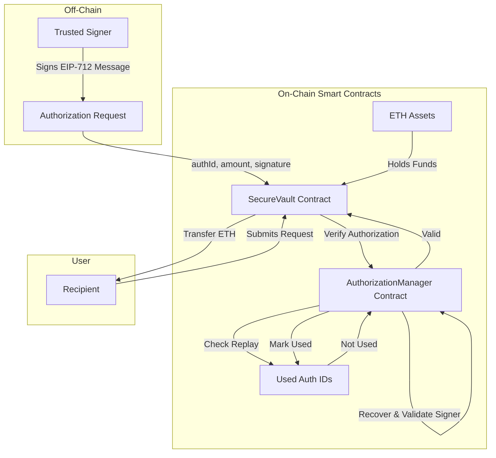
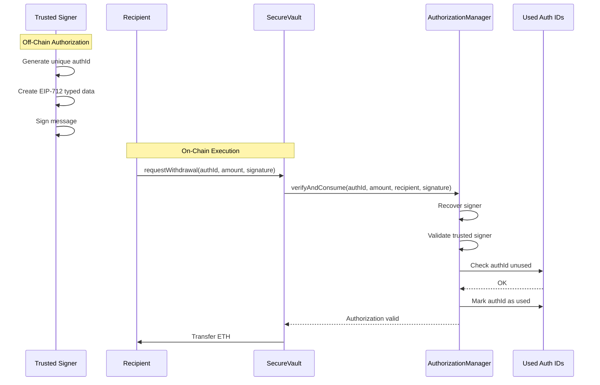
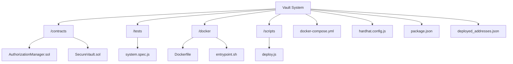

# 🔐 Secure Vault System

A blockchain-based secure vault that utilizes **EIP-712 Typed Data Signatures** to authorize withdrawals.
Funds are released **only** when a trusted off-chain signer provides a valid, unique cryptographic authorization.

---

## 🚀 System Architecture

The system consists of two core smart contracts:

1. **AuthorizationManager**

   * Verifies EIP-712 signatures
   * Confirms the trusted signer
   * Prevents replay attacks using unique `authId`s

2. **SecureVault**

   * Custodies ETH
   * Delegates authorization checks
   * Releases funds only after verification



---

## 🛠 Features

* **EIP-712 Cryptographic Security**
  Human-readable, domain-separated structured data signing.

* **Replay Protection**
  Each authorization can be consumed **once and only once**.

* **Reentrancy Protection**
  Uses OpenZeppelin’s `ReentrancyGuard`.

* **Separation of Concerns**
  Authorization logic is isolated from asset custody.

* **Dockerized Environment**
  Reproducible Hardhat development and testing setup.

---

## 🔄 Withdrawal Flow



---

## 📋 Prerequisites

* **Docker**
* **Docker Compose**
* **Node.js** *(optional for local development)*

---

## ⚙️ Setup & Deployment

### 1️⃣ Start the Environment

```bash
docker-compose up -d
```

This starts a local blockchain and deploys the contracts automatically.

---

### 2️⃣ Verify Deployment

```bash
cat deployed_addresses.json
```

---

## 🧪 Local Validation (System Integration Tests)

Automated tests verify:

* ❌ **Unauthorized Access**
  Invalid or forged signatures revert.

* ✅ **Authorized Withdrawal**
  Valid EIP-712 signatures release ETH.

* 🔁 **Replay Attack Prevention**
  The same `authId` cannot be reused.

### Run Tests

```bash
docker-compose exec vault-system npx hardhat test tests/system.spec.js
```

### Expected Output

```text
SecureVault Security Validation
  ✔ Should FAIL: Unauthorized or invalid signature
  ✔ Should SUCCEED: Valid EIP-712 signature allows withdrawal
  ✔ Should FAIL: Replay attack using same authId
```

---

## 📂 Project Structure



---

## 🔐 Security Notes

* `trustedSigner` is set **during deployment** of `AuthorizationManager`
* Never expose the trusted signer’s private key
* Rotate the signer by redeploying if compromised
* Assumes secure off-chain key management

---

## ✅ Final Checklist

1. Save this file as **`README.md`**
2. Ensure `tests/system.spec.js` is the **only test file**
3. Run the final verification:

```bash
docker-compose exec vault-system npx hardhat test tests/system.spec.js
```

---
